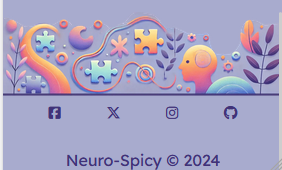

## <u>Neuro-Spicy</u>

[View live project here]()

This proposed website aims to bridge that gap in understanding. By providing relatable scenarios and clear explanations, the platform will help users empathize with and better navigate relationships with people who have ADHD. The website's primary goal is to facilitate better communication and reduce the frustration, confusion, and tension that can result from the common symptoms of ADHD.

 

---

## CONTENTS

* [UXD (User Experience Design) ](#user-experience-ux)
  * [User Stories](#user-stories)
* [Creation process (Strategy -> Surface)](#creation-process)
[Wireframes](#wireframes)
* [Design](#design)
  * [Colour Scheme](#color-scheme)
  * [Typography](#typography)
  * [Imagery](#imagery)
* [Page Features](#page-features)
  * [Navbar](#navbar)
  * [Hero-Image](#hero-image)
  * [Footer](#footer)  
* [Tablet & Mobile View](#tablet--mobile-view)
  * [Desktop, Tablet & Mobile Differences](#desktop-tablet--mobile-differences)
  * [Tablet View](#tablet-view-ipad-miniipad-prosurface-pro)
  * [Mobile View](#mobile-view-iphone-5iphone-seiphone-xriphone-12-pro)
* [Future Features](#future-features)
* [Technologies Used](#technologies-used)
  * [Languages Used](#languages-used)
  * [Frameworks, Libraries, Technologies & Programs Used](#frameworks-libraries-technologies--programs-used)
* [Testing](#testing)
  * [HTML Validation using W3C Validation](#html-validation-using-w3c-validation)
  * [CSS Validation using W3C Validation](#css-validation-using-w3c-validation)
  * [Lighthouse scores via Chrome Developer Tools](#lighthouse-scores-via-chrome-developer-tools)
  * [Bugs & Fixes](#bugs--fixes)
  * [Unsolved Bugs](#unsolved-bugs)
* [Credits](#credits) 

---

## User Experience (UX)  

### **User Stories**

### Primary Goal

The website will be designed as an educational resource, offering insights into why certain behaviors and reactions occur in individuals with ADHD. Its core purpose is to:

    *  Foster empathy and understanding: By breaking down ADHD symptoms into understandable and relatable cenarios, the website will help users grasp why a seemingly small incident 
       might trigger a strong reaction.

    *  Reduce conflict: When people better understand the underlying reasons behind ADHD-driven behaviors, they can approach conversations and conflicts with more patience and less 
       frustration, leading to healthier, more constructive dialogues.

    *  Provide tools for communication: In addition to understanding, the website will offer practical advice and tools for better communication with people who have ADHD, helping to 
       navigate difficult moments more effectively.

### **First Time Users**

   * New users will find a friendly and easy to use website.
   * New users can asscess all pages and information from the navigation section found at the top of the page.
   * New users will find a button on all pages of websites that can help. (minds matter, Heaven Talking Therapies)

### **Returning Users** 

   * Returning users can easily find and re-read the information for help.
   * Returning users can easily find ways to share the information to friends or family member.

---

# Creation Process  
  
### **1. Strategy** 

* I need a website that is friendly and inviting to both people with and without ADHD.
* The website must be easy to read and undertand from both prospectives.
* The website needs to be easy to navigate.
* Users will require mobile responsiveness to make it easy to access anywhere.

### **2. Scope**  

The website needs to be available on multipul device sizes to allow users to get to the information at anytime from any device. 

* A selection of text that are known to be easy to read.
* The site needs information on ADHD from the prospective of both sides.
*The information needs to come across as informative and not like the blame is being pushed one way.
* The website needs to be friendly and not offencive to anyone with or without ADHD.

### **3. Structural**  

This website will be simple to use and easy to navigate for all ages. Accessale and functional on m ultipul screen sizes.

* Easy to find navigation and what page you are currently on.
* Any buttons and links will highlight on hover to make them easy to reconize as clickable.
* Navigation and footer bar will be on every page to make the layout easy to contiuly use.
* To keep the same page layout to make the website feel like a safe space.

### **4. Skeleton** 

This website is being developed to be simple to use and naviagte. To show information that could help bring people closer togther with less conflicts.

* The Navagation bar will be found at the top of the webpage.
* The (Hero Image) logo will show be shown on the landing page.
* The text will be large enough to easily read and if nessasery letter spaceings will be used
* The information will be given from the persepctive of someone with ADHD but made easy to understand from a non Neuro-Spicy side.

### Wireframes 

Wireframe - Homepage Mobile
  

 

Wireframe - Homepage Desktop
  

 

Wireframe - Living with ADHD page Mobile
  

After getting feedback from people who live with ADHD. I deciceded to change my website to better cater to the needs of the people who it is aimed towards.

As you can see from the two wireframes there is a drastic change. This is due to the site being to busy and distracting. Taking the people it is targeted towards away from the imformation.

I have left the old wireframes in to show the differences.

 

Wireframe - Living with ADHD page Desktop
  

After getting feedback from people who live with ADHD. I deciceded to change my website to better cater to the needs of the people who it is aimed towards.

As you can see from the two wireframes there is a drastic change. This is due to the site being to busy and distracting. Taking the people it is targeted towards away from the imformation.

I have left the old wireframes in to show the differences.

 

Wireframe - Living with a ADHD page Mobile
  

After getting feedback from people who live with ADHD. I deciceded to change my website to better cater to the needs of the people who it is aimed towards.

I now have a page dedicated to Living with ADHD (See wireframes above)

My origanal design was aimed at people who live with a person who has ADHD. I have changed the site to make the information more available and easier to get to. 

For people who are reading this site with their loved ones I have kept the page simular to the one above. Making it familiar and easy to access the information.

 

Wireframe - Living with a ADHD page Desktop
  

After getting feedback from people who live with ADHD. I deciceded to change my website to better cater to the needs of the people who it is aimed towards.

I now have a page dedicated to Living with ADHD (See wireframes above)

My origanal design was aimed at people who live with a person who has ADHD. I have changed the site to make the information more available and easier to get to. 

For people who are reading this site with their loved ones I have kept the page simular to the one above. Making it familiar and easy to access the information.

 

### **5. Surface**  

I designed a creation process from a non- ADHD point of view. A view from someone who lives with people that have ADHD and wishing there was a website like this to help me understand this condition.

* I picked a palette that is welcoming, calming and most importantly visually apealing to people with ADHD.
* I picked a clear and easy to read font for my headings and titles.
* I picked a clear and easy to read font for my paragrahs.

---

## Design  

### **Color Scheme**

The Original colours didn't work for the site. These are the new colours I have used.

I changed these due to the way the original colours clashed and feedback from testers.

details >

Neuro-Spicy Colour Palette
  

 

This is the colour palette I chose as my inital colours.

details >

Neuro-Spicy Colour Palette
  

 

### **Typography**

I chose these fonts as they are easy to read.
The reasearch i did have been suggested that these fonts are easy to read for people with ADHD. 

* For headers and footers
   * [Google Fonts](https://fonts.google.com/specimen/Fira+Mono?query=+Fira+Sans) was used to inport Fira Mono bold with a weight of 700

* For the rest of the site.
   * [Google Fonts](https://fonts.google.com/specimen/Lexend?query=lex) was used to import the font Lexend with a weight of 300/400

### **Imagery** 

The images I have chosen are to make the site feel safe and welcoming. I have also chosen a few in hope that it can make someone smile while learning how to better their realtionship with Neuro-Spicy people.

---

## Page Features 

### **Navbar** 
 

Neuro-Spicy Desktop Naviagtion bar
  

 

### **Hero Image**

Neuro-Spicy Hero Image
  

 

### **Footer**

### **Hero Image**

Neuro-Spicy Desktop Footer
  

 

## Tablet & Mobile View  

### **Hero Image**

Neuro-Spicy Hero and Navigation Tablet
  

 

Neuro-Spicy Hero and Navigation Phone
  

 

Neuro-Spicy Footer Tablet
  

 

Neuro-Spicy Hero and Navigation Tablet
  

 
 
### **Desktop, Tablet & Mobile Differences** 

I kept the differences to a minamul. This is to keep the site ADHD friendly.

* The Navbar changes from mobile to desktop.
* The layout changes slightly for the Home and living with a ADHD pages 

### **Tablet View (iPad Mini/iPad Pro/Surface Pro)**

screenshot to be added

### **Mobile View (iPhone 5/iPhone SE/iPhone XR/iPhone 12 Pro)** 

screenshot to be added

## Future Features

* More information to help those with and without ADHD.
* More Pages to help others with different mental health diagnoses. eg Autisum.

---

### **Languages Used**   

- HTML5
- CSS3
-JavaScript

### **Frameworks, Libraries, Technologies & Programs Used** 

* Balsamiq - used to create wireframes.
* GitHub - used to save and store all files. 
* Git - used for version control.
* GitPod - used as a workspace.
* Visual Studio Code - Used to SSH into my GitPod workspace.
* Google Fonts - fonts were chose imported from here 
* Font Awesome - icons and their associated kit were downloaded from here  
* Cooler - for all color palettes and accessibility contrast ratios  
* Hotpot AI - for favicon  
* Tiny PNG - to compress images 
* Dev Tools - to debug and for testing responsiveness 
* Google Lighthouse - for auditing the website
* W3C Validator - for validating the HTML and CSS code
* Krita - For touching up the images.

---   

## Testing  

### **Initial testing plan**

### Testing browsers

* Firefox
* Chrome
* Edge

### **HTML Validation using W3C Validation**

### **CSS Validation using W3C Validation**

### **Lighthouse scores via Chrome Developer Tools**

### **Bugs & Fixes**

### **Unsolved Bugs** 

---

## Credits  

Friends and Family img
Image by <a href="https://pixabay.com/users/alexas_fotos-686414/?utm_source=link-attribution&utm_medium=referral&utm_campaign=image&utm_content=1743395">Alexa</a> from <a href="https://pixabay.com//?utm_source=link-attribution&utm_medium=referral&utm_campaign=image&utm_content=1743395">Pixabay</a>

Image by Alexa from Pixabay

Logo image and favicon ChatGPT

Hero image ChatGPT

ADHD
Photo by Tara Winstead: <a href"https://www.pexels.com/photo/a-notebook-with-notes-about-adhd-8378749"> found on Pexels</a>

  
### **Content References**

Living with 4 people with ADHD and having lived with one of them for 22 years.
Experiences I have had living with a ADHD 

Someone with ADHD giving an account for what it is like for them. The good, the bad and the ugly.

### **Acknowledgements**

I would like to thank my laeason for Code Insitute Amy for bringing and potraying confidence everyday, as I think it helps everyone not only feel more confident in themselves but also gives the feeling of I can do this.

I would like to thank my husband for letting me pry into his brain, for being honest with the great things about ADHD but also the bad. This information was invauleable for completeing this website.

I would like to thank my family for putting up with me. 

Also my testers who gave amazing feedback to help me finish this site.